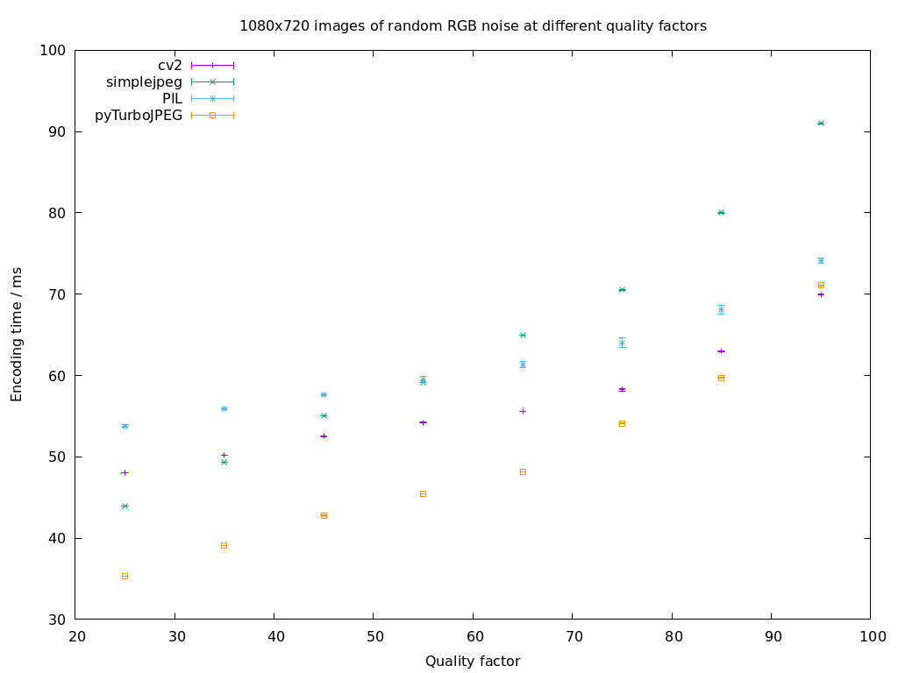

# Python JPEG encoding library performance

A range of python libraries supporting jpeg encoding exists, here we compare [OpenCV (cv2) 4.4.0](https://opencv.org/), [SimpleJPEG 1.4.0](https://pypi.org/project/simplejpeg/), [PyTurboJPEG 1.4.1 (libjpeg-turbo 1.5.2)](https://pypi.org/project/PyTurboJPEG/), [PIL 5.4.1](https://pillow.readthedocs.io/en/stable/#).  Some these may rely on libjpeg 62.2 or libjpeg-turbo 1.5.2.

## Methods

Each method was used to encode 100 images, each 25 times, resized to various resolutions supported by picamera. Total time for the 25 encoding was recorded together with the total size of resulting encoded images. Quality factor of 75 was used for all libraries, but based on different resulting sizes this appears to be interpreted differently by the different libraries. To check the dependence between quality factor, encoding time, the same process was used to compare different quality factors at a fixed 1080x720 resolution. The same test was run with 100 images of stained red blood cells taken using the [OpenFlexure microscope](https://openflexure.org/projects/microscope/) and 100 images of randomly generated RGB noise (each colour in each pixel was set to a random 0-255 value).

These experiments were performed on a Raspberry Pi 3 Model B Rev 1.2 running Raspbian Buster with kernel v5.4.51-v7+.

## Results

### Different resolutions
Graphs below show the timing and resulting size for varying resolution at fixed quality factor. Error bars indicate standard deviation within the 100 image set. PIL and cv2 encoded the random images to the exact same size.

TurboJPEG appears to outperform other methods here, PIL and opencv produce images of the same size.

### Different qualities
Encoding the same set of images (or fresh set of randomly generated images) resized to 1080x720 at various quality levels.

Assuming that the same size means approximately the same quality, performance can be compared by looking at image size vs encoding time

# Discussion
TurboJPEG appears to live up to its name and be the fastest option. While some of it advantage
might be attributable to the different interpretation of quality factor by the various libraries,
looking at the the size(time) graph indicates it is significantly faster even at the same resulting
filesizes.
Interestingly, there was one situation in which opencv performed slightly better, namely encoding
a random image at 95 quality factor. However, this is an extremely artificial example as jpeg is
completely unsuitable for images of this nature. In more realistic situations TurboJPEG's advantage
is signifcantly larger.

Collecting the sizes of produced images introduced some overhead, but this should not be significant.
The libraries have slightly different input and output formats, the timed process was going from a numpy array representing the image
data in the order more convenient for the library (RGB/BGR) to an encoded representation in any form returned (numpy array, BytesIO, bytes).
This does not represent every usecase and avoiding data manipulation before and/or after encoding could be more significant consideration
than encoding performance as shown here.

# Future work
It is possible to use the raspberry pi GPU to do jpeg encoding, but in some early tests it was significantly slower,
likely due to overheads, possibly due less then ideal use if the MMAL library (reusing the ImageEncoder component required
disabling and enabling it again, other buffers were not available, the documentation on this in PiCamera is somewhat lacking).
However, even if it is were to be slightly slower, there might be some benefit to offloading this to the GPU in certain applications,
so that the CPU can handle other tasks. Using MJPEG and the VideoEncoder component might result in significant improvement,
but getting this set up is far from trivial.

# Conclusion
TurboJPEG outperforms other tested libraries for JPEG encoding on the raspberry pi.

# Reproducing these results
jpeg\_encoding\_performance\_full.py contains all code needed to reproduce these results. Use the last 4 lines
to switch between quality/resolution comparisons and between using random images and cell images and redirect
the output to appropriate files.

The plots folder contains gnuplot scripts to make the plots based on data in data folder.
The cell\_images folder contains used images of red blood cells used here.
